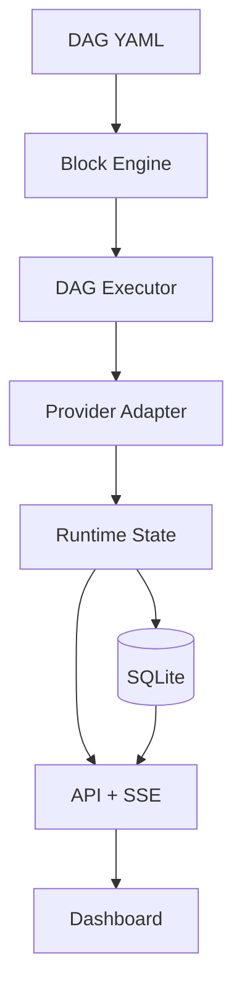
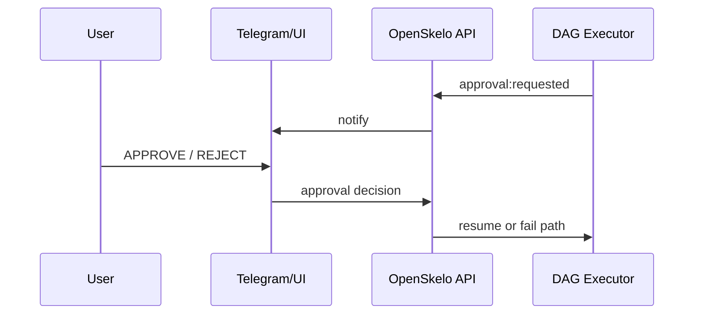

# 🦴 OpenSkelo

**Give your AI agents a backbone.**

Your AI agents have brains (LLMs) and muscles (OpenClaw, CrewAI, LangGraph). OpenSkelo gives them a skeleton — deterministic structure so they ship reliably, not just chat.

> Quality gates for AI agent output. Deterministic DAG runtime. Runs on your laptop.

[](LICENSE)

---

## Why OpenSkelo?

Every AI agent framework lets agents *talk*. None of them make agents *ship*.

- **CrewAI** — agents collaborate, but no quality gates
- **LangGraph** — powerful graphs, but no pipeline discipline
- **AutoGen** — agents chat, but non-deterministic output

OpenSkelo is different. It's not another agent framework — it's the **skeleton** that gives any agent framework structure:

- 🔒 **Deterministic gates** — transitions are validated, not hoped for
- ⚙️ **Config-driven** — your entire pipeline in one YAML file
- 🏠 **Local-first** — runs on your laptop with Ollama, zero API costs
- 👁️ **Observable** — built-in DAG UI, audit logs, gate logs
- 🔌 **Pluggable** — OpenClaw + Ollama + OpenAI-compatible adapters supported today

## Runtime Status (Important)

- ✅ **Canonical runtime:** `/api/dag/*` (DAG engine, approvals, replay, durability)
- ✅ **Legacy surface removed from CLI default path**; migration targets DAG runtime APIs/commands

### Provider Support Matrix (Current)

| Provider Type | Status | Notes |
|---|---|---|
| `openclaw` | ✅ Implemented | Native OpenClaw adapter |
| `ollama` | ✅ Implemented | Uses Ollama `/api/chat` |
| `openai` | ✅ Implemented via openai-compatible | Uses `/chat/completions` |
| `http` | ✅ Implemented via openai-compatible | Configurable base URL + auth header/env |
| `anthropic` | 🟨 Routed via openai-compatible path | Native Anthropic adapter planned |

## Quick Start (DAG-first)

```bash
# Start runtime
npx openskelo start

# Run a bundled DAG example
npx openskelo run start --example coding-pipeline.yaml --context-json '{"prompt":"Build a login endpoint"}'

# Or use planner thin-slice from natural language
npx openskelo autopilot "Add rate limiting to the API"
```

Then open:
- Dashboard: `http://localhost:4040/dag`
- DAG API: `http://localhost:4040/api/dag/*`

> `skelo init --template ...` now generates v2 DAG-first project structure.

## How It Works

### 1. Define your workflow as a DAG (`examples/*.yaml`)

```yaml
blocks:
  - id: plan
    outputs:
      plan: { type: string }
    agent:
      provider: local
      model: llama3:8b
      prompt: "Produce an implementation plan for: {{inputs.goal}}"

  - id: implement
    inputs:
      plan: { from: plan.plan }
    outputs:
      patch: { type: string }
    agent:
      provider: local
      model: codellama:13b
      prompt: "Implement this plan:\n{{inputs.plan}}"
    post_gates:
      - check:
          type: semantic_review
          required_terms: ["error handling", "tests"]
        error: "Implementation is missing required quality signals"
```

This YAML is the runtime IR. The execution contract is block/edge/gate driven via `/api/dag/*`.

### 2. Blocks are the core building unit

A **block** is a single step in your workflow DAG.

Each block has:
- typed **inputs** and **outputs**
- an **agent/provider** assignment
- optional **pre/post gates**
- optional **retry policy**
- optional **human approval**

Think of it like this:

`spec -> build -> qa -> release`

OpenSkelo runs blocks in dependency order, tracks each block's runtime metadata, and lets you inspect/replay runs safely.

Quick architecture view:

```text
[DAG YAML]
   ↓
[Block Engine] → validate types/wiring/gates
   ↓
[DAG Executor] → run/order/retry/approval/stop
   ↓
[Provider Adapter] → OpenClaw (or other provider)
   ↓
[Runtime + DB] → run state, events, approvals
   ↓
[API + SSE + Dashboard]
```



Approval flow (high level):



### 4. Gates enforce quality — deterministically

Gates are rules that **cannot be bypassed silently**. Block execution and progression fail when gates fail.

**Current gate checks include:** `contains`, `matches`, `min_length`, `max_value`, `valid_json`, `valid_url`, `shell`, `json_schema`, `http`, `diff`, `cost`, `latency`, `semantic_review`, and `llm_review`.

> `semantic_review` is the deterministic keyword-coverage baseline. `llm_review` is the second-model semantic judge gate with structured criterion scoring.

Minimal `llm_review` example:

```yaml
post_gates:
  - name: semantic-judge
    check:
      type: llm_review
      port: draft
      provider: local
      model: llama3:8b
      criteria:
        - "Includes error handling"
        - "Mentions tests"
      pass_threshold: 1.0
      timeout_ms: 15000
    error: "Draft failed semantic quality review"
```

The `shell` check remains an escape hatch (explicitly opt-in) for environment-specific validation.

## Templates

Template migration note:
- `skelo init --template ...` is currently being updated to DAG block format.
- Until that lands, treat `examples/*.yaml` as canonical templates.

```bash
# canonical today
npx openskelo run start --example basic
npx openskelo run start --example coding
```

## CLI Reference

> `skelo task *` commands are legacy-deprecated and will be removed in the next release.

```bash
skelo init [name]              # Create new project
skelo start                    # Start OpenSkelo runtime server
skelo status                   # Pipeline health overview
skelo run start --example ...  # Start DAG run (canonical)
skelo run list                 # List DAG runs
skelo run status <runId>       # DAG run status
skelo run watch <runId>        # Terminal watch view (shareable)
skelo run approve <runId>      # Approve pending gate
skelo run reject <runId> --feedback "..."   # Reject pending gate
skelo run stop <runId>         # Stop a run
skelo agents                   # List registered agents
skelo gates                    # List pipeline gates
skelo logs                     # Stream audit log
skelo validate                 # Validate skelo.yaml
```

## API

When running, OpenSkelo exposes a REST API.

- Canonical runtime: `/api/dag/*`
- Legacy `/api/tasks*` runtime: removed in hard-cut release

```
GET    /api/health          — Runtime health
GET    /api/config          — Current configuration
GET    /api/agents          — List configured agents
GET    /api/gates           — List configured gates

POST   /api/dag/run         — Start DAG run
GET    /api/dag/runs        — List runs
GET    /api/dag/runs/:id    — Run state
GET    /api/dag/runs/:id/replay?since=<seq> — Durable replay events
POST   /api/dag/runs/:id/approvals — Approve/reject pending approval
POST   /api/dag/runs/:id/stop — Stop run
POST   /api/dag/runs/stop-all — Emergency stop all runs
GET    /api/dag/safety      — Effective safety policy
```

## DAG API Reliability Contracts

OpenSkelo's canonical runtime is the DAG API (`/api/dag/*`).

### Replay and resume
- SSE event stream supports replay via `Last-Event-ID` / `since`
- Durable replay endpoint: `GET /api/dag/runs/:id/replay?since=<seq>`
- Events include durable sequence numbers (`seq`)

### Durability
- Run snapshots and events are persisted in SQLite (`dag_runs`, `dag_events`, `dag_approvals`)
- `GET /api/dag/runs/:id` supports durable fallback when run is not in memory

### Safety controls
- Hard stop single run: `POST /api/dag/runs/:id/stop`
- Emergency stop all: `POST /api/dag/runs/stop-all`
- Safety policy introspection: `GET /api/dag/safety`


## Known Gaps (Post-audit follow-up)

- Planner is currently thin-slice heuristic generation; model-native DAG planning can be expanded.
- `llm_review` test matrix still needs explicit provider-error and timeout-path cases.
- Viral demo artifact package (terminal-first shareable output + recorded walkthrough) is next shipping lane.

## 60-Second Demo

- Quick walkthrough: `docs/DEMO-60S.md`
- Terminal-first capture runbook: `docs/DEMO-VIRAL-RUNBOOK.md`
- Launch post draft: `docs/LAUNCH-POST-DRAFT.md`
- Claim alignment: `docs/CLAIM-ALIGNMENT.md`
- ID strategy review: `docs/ID-STRATEGY-REVIEW.md`
- Mutable-state contract: `docs/MUTABILITY-CONTRACT.md`
- Error model baseline: `src/core/errors.ts`
- Mutation testing plan (optional lane): `docs/MUTATION-TESTING-PLAN.md`
- Executor/API isolation strategy: `docs/EXECUTOR-ISOLATION-PLAN.md`
- Hosted queue strategy (future): `docs/HOSTED-QUEUE-STRATEGY.md`
- Audit closure report: `docs/AUDIT-CLOSURE-REPORT.md`

## Testing & Reports

- Optional real-provider profile: set `OPENSKELO_RUN_PROVIDER_INTEGRATION=1` before `npm test` to enable provider integration tests (skipped by default in CI).
- Provider param passthrough tests: `tests/provider.params.test.ts`.

```bash
npm run test
npm run test:coverage
npm run test:report
```

`npm run test:report` generates architecture-review artifacts under `docs/reports/`:

- `vitest-results.json`
- `coverage/coverage-summary.json`
- `test-summary.json`
- `test-summary.md`


## The Skeleton Metaphor

```
🧠 LLMs         = Brain (intelligence)
💪 OpenClaw      = Muscles (execution)
🦴 OpenSkelo     = Skeleton (structure)
```

Without a skeleton, your agents are smart but shapeless — they produce output but with no reliability, no quality control, no reproducibility.

OpenSkelo is the bones that make everything else work together.

## License

MIT — do whatever you want with it.
