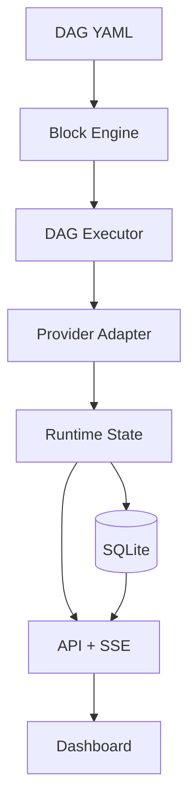
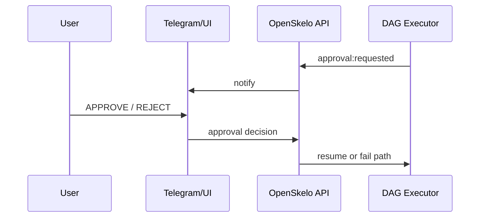

# 🦴 OpenSkelo

**Give your AI agents a backbone.**

Your AI agents have brains (LLMs) and muscles (OpenClaw, CrewAI, LangGraph). OpenSkelo gives them a skeleton — deterministic structure so they ship reliably, not just chat.

> CI/CD for AI agents. One config file. Runs on your laptop. Costs $0.

[](LICENSE)

---

## Why OpenSkelo?

Every AI agent framework lets agents *talk*. None of them make agents *ship*.

- **CrewAI** — agents collaborate, but no quality gates
- **LangGraph** — powerful graphs, but no pipeline discipline
- **AutoGen** — agents chat, but non-deterministic output

OpenSkelo is different. It's not another agent framework — it's the **skeleton** that gives any agent framework structure:

- 🔒 **Deterministic gates** — transitions are validated, not hoped for
- ⚙️ **Config-driven** — your entire pipeline in one YAML file
- 🏠 **Local-first** — runs on your laptop with Ollama, zero API costs
- 👁️ **Observable** — built-in dashboard, audit logs, gate logs
- 🔌 **Pluggable** — works with Ollama, OpenAI, Anthropic, OpenClaw, or any HTTP endpoint

## Quick Start

```bash
# Create a new pipeline project
npx openskelo init my-pipeline --template coding

# Enter the project
cd my-pipeline

# Start the pipeline
npx openskelo start
```

```
🦴 OpenSkelo starting...

  ✓ Config loaded: my-pipeline
  ✓ Database initialized (.skelo/skelo.db)
  ✓ 2 agents registered
  ✓ 1 pipeline, 4 gates

  🔥 OpenSkelo running

  Pipeline:  http://localhost:4040
  Dashboard: http://localhost:4040/dashboard
  API:       http://localhost:4040/api

  🔧 coder (worker, codellama:13b)
  🔍 reviewer (reviewer, llama3:8b)
```

## How It Works

### 1. Define your pipeline in `skelo.yaml`

> Note: names like `coder` and `reviewer` below are example labels only. You can name agents anything.

```yaml
name: my-pipeline

providers:
  - name: local
    type: ollama
    url: http://localhost:11434

agents:
  coder:
    role: worker
    capabilities: [coding]
    provider: local
    model: codellama:13b
    max_concurrent: 1

  reviewer:
    role: reviewer
    capabilities: [coding]
    provider: local
    model: llama3:8b
    max_concurrent: 1

pipelines:
  coding:
    stages:
      - name: PENDING
        transitions: [IN_PROGRESS]
      - name: IN_PROGRESS
        route: { role: worker, capability: coding }
        transitions: [REVIEW, BLOCKED]
      - name: REVIEW
        route: { role: reviewer, capability: coding }
        transitions: [DONE, IN_PROGRESS]
      - name: DONE

gates:
  - name: structured-feedback
    on: { from: REVIEW, to: IN_PROGRESS }
    check: { type: contains, field: notes, values: ["WHAT:", "WHERE:", "FIX:"] }
    error: "Bounce requires structured feedback"

  - name: done-evidence
    on: { to: DONE }
    check: { type: min_length, field: notes, min: 10 }
    error: "Provide evidence of completion"
```

### 2. Create and manage tasks

```bash
# Create a task
skelo task create --pipeline coding --title "Add auth middleware" --assign coder

# Check status
skelo status

# View task detail
skelo task show TASK-001

# Update status (gates enforce quality)
skelo task update TASK-001 --status REVIEW --notes "Ready for review"

# Try a bad bounce (gate rejects it!)
skelo task update TASK-001 --status IN_PROGRESS --notes "bad"
# ✗ Gate 'structured-feedback' failed: notes missing: WHAT:, WHERE:, FIX:

# Proper bounce (gate passes)
skelo task update TASK-001 --status IN_PROGRESS \
  --notes "WHAT: Missing error handler WHERE: auth.ts:42 FIX: Add try/catch"
# ✓ TASK-001: REVIEW → IN_PROGRESS
```

### 3. Blocks are the core building unit

A **block** is a single step in your workflow DAG.

Each block has:
- typed **inputs** and **outputs**
- an **agent/provider** assignment
- optional **pre/post gates**
- optional **retry policy**
- optional **human approval**

Think of it like this:

`spec -> build -> qa -> release`

OpenSkelo runs blocks in dependency order, tracks each block's runtime metadata, and lets you inspect/replay runs safely.

Quick architecture view:

```text
[DAG YAML]
   ↓
[Block Engine] → validate types/wiring/gates
   ↓
[DAG Executor] → run/order/retry/approval/stop
   ↓
[Provider Adapter] → OpenClaw (or other provider)
   ↓
[Runtime + DB] → run state, events, approvals
   ↓
[API + SSE + Dashboard]
```



Approval flow (high level):



### 4. Gates enforce quality — deterministically

Gates are rules that **cannot be broken**. The API rejects transitions that fail gates.

**Built-in gate checks:**

| Check | What it validates |
|---|---|
| `not_empty` | Field must have a value |
| `contains` | Field must include specific strings |
| `matches` | Field must match a regex pattern |
| `min_length` | Field must be at least N characters |
| `max_value` | Numeric field must be under a limit |
| `valid_json` | Field must be valid JSON |
| `valid_url` | Field must be a valid URL |
| `shell` | Custom shell command (exit 0 = pass) |

The `shell` check is the escape hatch — any validation you can write as a bash one-liner works as a gate.

## Templates

```bash
skelo init my-project --template coding    # Coder + Reviewer pipeline
skelo init my-project --template research  # Researcher with source validation
skelo init my-project --template content   # Writer + Editor with revision loop
skelo init my-project --template custom    # Blank starting point
```

## CLI Reference

```bash
skelo init [name]              # Create new project
skelo start                    # Start pipeline server + dashboard
skelo status                   # Pipeline health overview
skelo task create              # Create a task
skelo task list                # List all tasks
skelo task show <id>           # Task detail with history
skelo task update <id>         # Update task status/fields
skelo agents                   # List registered agents
skelo gates                    # List pipeline gates
skelo logs                     # Stream audit log
skelo validate                 # Validate skelo.yaml
```

## API

When running, OpenSkelo exposes a REST API:

```
GET    /api/health          — Pipeline health
GET    /api/config          — Current configuration
GET    /api/tasks           — List tasks (?status=, ?pipeline=)
POST   /api/tasks           — Create task
PATCH  /api/tasks/:id       — Update task (gates enforced)
GET    /api/tasks/:id       — Get task detail
GET    /api/tasks/counts    — Task counts by status
GET    /api/agents          — List agents
GET    /api/gates           — List gates
GET    /api/logs            — Audit log (?task=, ?limit=)
GET    /api/gate-log        — Gate evaluation log
```

## DAG API Reliability Contracts

OpenSkelo's canonical runtime is the DAG API (`/api/dag/*`).

### Replay and resume
- SSE event stream supports replay via `Last-Event-ID` / `since`
- Durable replay endpoint: `GET /api/dag/runs/:id/replay?since=<seq>`
- Events include durable sequence numbers (`seq`)

### Durability
- Run snapshots and events are persisted in SQLite (`dag_runs`, `dag_events`, `dag_approvals`)
- `GET /api/dag/runs/:id` supports durable fallback when run is not in memory

### Safety controls
- Hard stop single run: `POST /api/dag/runs/:id/stop`
- Emergency stop all: `POST /api/dag/runs/stop-all`
- Safety policy introspection: `GET /api/dag/safety`


## Testing & Reports

```bash
npm run test
npm run test:coverage
npm run test:report
```

`npm run test:report` generates architecture-review artifacts under `docs/reports/`:

- `vitest-results.json`
- `coverage/coverage-summary.json`
- `test-summary.json`
- `test-summary.md`


## The Skeleton Metaphor

```
🧠 LLMs         = Brain (intelligence)
💪 OpenClaw      = Muscles (execution)
🦴 OpenSkelo     = Skeleton (structure)
```

Without a skeleton, your agents are smart but shapeless — they produce output but with no reliability, no quality control, no reproducibility.

OpenSkelo is the bones that make everything else work together.

## License

MIT — do whatever you want with it.
