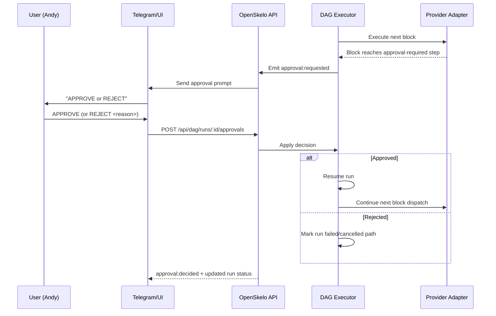
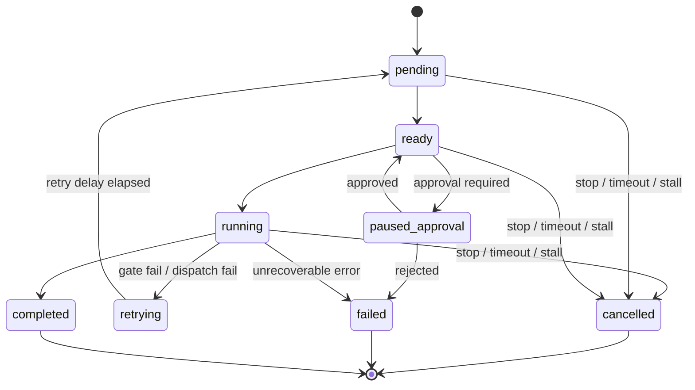

# OpenSkelo Documentation

## Overview

OpenSkelo is a **deterministic pipeline runtime for AI agents**. Think of it like CI/CD for AI agents — instead of just prompting an LLM and hoping for the best, you define a pipeline with gates that must pass before work can move forward.

**Core concept:** A pipeline is made of **blocks** connected as a DAG. Each block has typed inputs/outputs, optional gates, and runs on an assigned agent/provider.

---

## Architecture

```
┌─────────────────────────────────────────────────────────────┐
│                     OpenSkelo Engine                         │
├─────────────────────────────────────────────────────────────┤
│  ┌──────────┐   ┌──────────────┐   ┌──────────────────┐   │
│  │  Config  │   │ Task Engine  │   │   Gate Engine    │   │
│  │(skelo.yaml)│   │ (state machine)│   │ (validators)    │   │
│  └──────────┘   └──────────────┘   └──────────────────┘   │
│         │              │                     │               │
│         └──────────────┼─────────────────────┘               │
│                        │                                     │
│                   ┌────┴────┐                                │
│                   │   DB    │ (SQLite)                       │
│                   │ tasks   │                                │
│                   │ audit   │                                │
│                   │ gates   │                                │
│                   └─────────┘                                │
├─────────────────────────────────────────────────────────────┤
│                    Router                                    │
│  ┌──────────────────────────────────────────────────────┐  │
│  │ Pipeline Stage → Agent Match (role + capability)      │  │
│  └──────────────────────────────────────────────────────┘  │
├─────────────────────────────────────────────────────────────┤
│                 Provider Adapters                            │
│  ┌─────────┐ ┌─────────┐ ┌──────────┐ ┌────────────┐     │
│  │ Ollama  │ │ OpenAI  │ │OpenClaw  │ │   HTTP     │     │
│  └─────────┘ └─────────┘ └──────────┘ └────────────┘     │
└─────────────────────────────────────────────────────────────┘
```

---

## Blocks (Plain English)

A **block** is one unit of work in a workflow.

Each block defines:
- **Inputs** (what it needs)
- **Outputs** (what it must produce)
- **Agent routing** (who should run it)
- **Gates** (rules to pass before/after execution)
- **Retry policy** (what happens on failure)
- **Optional approval** (human approval before continuing)

Blocks are connected by **edges** in a DAG:
- Upstream block outputs become downstream block inputs
- OpenSkelo executes blocks in dependency order
- Independent blocks can run in parallel

Why this matters:
- Easier debugging (you can inspect each block)
- Better reliability (gates/retries/approval per block)
- Safer operations (stop/replay/audit at run + block level)

Example (conceptual):

`spec -> build -> qa -> release`

### Visual: What a single block contains

```text
┌──────────────────────────────────────────────┐
│ Block: build                                │
├──────────────────────────────────────────────┤
│ Inputs   : game_spec, dev_plan              │
│ Agent    : route by role/capability         │
│ Pre-gates: required inputs present          │
│ Execute  : provider dispatch (OpenClaw)     │
│ Post-gates: artifact_html must exist        │
│ Retry    : max_attempts=2, backoff=linear   │
│ Output   : artifact_html, changelog, branch │
└──────────────────────────────────────────────┘
```

### Visual: How blocks tie into OpenSkelo architecture

```text
DAG YAML
  ↓ parse
Block Engine (types/wiring/gates)
  ↓ ready-to-run blocks
DAG Executor (scheduling + retries + approvals)
  ↓ dispatch
Provider Adapter (OpenClaw/Ollama/OpenAI/...)
  ↓ result
Runtime State (run + block metadata)
  ↓ persist
SQLite (dag_runs, dag_events, dag_approvals)
  ↓ surface
API + SSE + /dag Dashboard
```

```mermaid
flowchart TD
  A[DAG YAML] --> B[Block Engine\nparse + validate + wire]
  B --> C[DAG Executor\nready queue + retries + approvals + stop]
  C --> D[Provider Adapter\nOpenClaw / Ollama / OpenAI / HTTP]
  D --> E[Runtime State\nrun + block metadata]
  E --> F[(SQLite\ndag_runs / dag_events / dag_approvals)]
  E --> G[API + SSE]
  G --> H[/dag Dashboard]
  F --> G
```

### Visual: Approval flow (Telegram/UI ↔ Runtime)



### Visual: Runtime lifecycle for one block

```text
pending → ready → running → completed
                     │
                     ├─ pre/post gate fail → retrying → pending
                     ├─ approval required → paused_approval
                     ├─ stop/timeout/stall → skipped/cancelled
                     └─ unrecoverable error → failed
```



---

## Core Components

### 1. Config (`skelo.yaml`)

Defines the entire system:
- **providers**: LLM backends (Ollama, OpenAI, OpenClaw, Anthropic, HTTP)
- **agents**: Workers with role, capabilities, model
- **pipelines**: DAG of stages with transitions
- **gates**: Validators that must pass for transitions

### 2. Task Engine

Manages task lifecycle:
```
PENDING → IN_PROGRESS → REVIEW → DONE
              ↑            ↓
              └── BLOCKED ←┘
```

Each task has:
- `id`: Auto-generated (TASK-001, TASK-002...)
- `pipeline`: Which pipeline
- `status`: Current stage
- `assigned`: Which agent
- `notes`: Documentation
- `bounce_count`: How many times returned from REVIEW
- `metadata`: Custom fields

### 3. Gate Engine

Deterministic validators. Each gate:
- **on**: Which transition triggers it (`from: PENDING, to: IN_PROGRESS`)
- **check**: What to validate
- **error**: Message when fails
- **bypass**: Roles that can skip it

**Check types:**
| Type | Purpose |
|------|---------|
| `not_empty` | Field must have value |
| `contains` | Field must contain strings |
| `matches` | Field matches regex |
| `min_length` | String min length |
| `max_value` | Number max value |
| `valid_json` | Field is valid JSON |
| `valid_url` | Field is valid URL |
| `shell` | Run command, check exit code |

### 4. Router

Finds the right agent for a stage:
1. Look at stage's `route` rule
2. Match by `role` + `capability`
3. Pick agent with lowest load
4. Exclude busy agents (at `max_concurrent`)

> Note: agent IDs in examples (e.g., `coder`, `reviewer`) are template labels, not platform requirements.

---

## Pipeline Stages

A pipeline is a DAG of stages:

```yaml
pipelines:
  coding:
    stages:
      - name: PENDING              # Initial state
        transitions: [IN_PROGRESS] # Can only go to IN_PROGRESS
      
      - name: IN_PROGRESS         # Work happening
        route: { role: worker, capability: coding }  # Auto-dispatch to coder
        transitions: [REVIEW, BLOCKED]
      
      - name: REVIEW              # Quality check
        route: { role: reviewer, capability: coding } # Auto-dispatch to reviewer
        transitions: [DONE, IN_PROGRESS]  # Approve or bounce
      
      - name: DONE               # Complete
      - name: BLOCKED             # Stuck, needs human
        transitions: [PENDING]    # Can restart
```

---

## How Work Flows (Canonical DAG Runtime)

```
User Input / Context
    ↓
POST /api/dag/run
    ↓
DAG run created (run_id)
    ↓
Executor resolves ready blocks
    ↓
Pre-gates + optional approval checks
    ↓
Provider dispatch
    ↓
Post-gates + contract checks
    ↓
Outputs propagate to downstream blocks
    ↓
Run completes / fails / iterates
```

---

## API Endpoints

| Method | Endpoint | Description |
|--------|----------|-------------|
| GET | `/api/health` | Server health |
| GET | `/api/config` | Current config |
| GET | `/api/agents` | List configured agents |
| GET | `/api/gates` | List configured gates |
| POST | `/api/dag/run` | Start DAG run |
| GET | `/api/dag/runs` | List runs |
| GET | `/api/dag/runs/:id` | Get run state |
| GET | `/api/dag/runs/:id/replay?since=<seq>` | Replay durable events |
| POST | `/api/dag/runs/:id/approvals` | Approve/reject pending approval |
| POST | `/api/dag/runs/:id/stop` | Stop one run |
| POST | `/api/dag/runs/stop-all` | Stop all active runs |
| GET | `/api/dag/safety` | Effective safety policy |

## DAG Runtime Contracts (Canonical)

OpenSkelo's canonical runtime is the DAG API (`/api/dag/*`).

### Core endpoints
- `POST /api/dag/run` — start a DAG run (example or inline DAG)
- `GET /api/dag/runs` — list active + durable runs
- `GET /api/dag/runs/:id` — run state (active or durable fallback)
- `GET /api/dag/runs/:id/events` — SSE stream with replay support
- `GET /api/dag/runs/:id/replay?since=<seq>` — deterministic replay cursor API
- `POST /api/dag/runs/:id/stop` — hard stop one run
- `POST /api/dag/runs/stop-all` — emergency hard stop all active runs
- `GET /api/dag/safety` — effective safety policy

### Determinism and durability
- Events are persisted with sequence IDs (`seq`) for replay.
- SSE supports `Last-Event-ID`/`since` resumption.
- Run snapshots/events/approvals are durable in SQLite:
  - `dag_runs`
  - `dag_events`
  - `dag_approvals`

### Safety guarantees
- Max concurrent run cap
- Max run duration auto-cancel
- Max block duration cap
- Retry cap enforcement
- Stall watchdog auto-cancel on no-progress
- Stop actions abort active dispatches immediately

---

## Current Demo State

The demo at `localhost:4040` has:
- **2 example agents**: `coder` (worker), `reviewer` (reviewer)
- **1 example pipeline**: "coding"
- **4 gates**:
  1. `needs-assignee` — PENDING→IN_PROGRESS requires "assigned" field
  2. `structured-feedback` — REVIEW→IN_PROGRESS requires "WHAT:", "WHERE:", "FIX:" in notes
  3. `done-evidence` — Any→DONE requires notes ≥10 chars
  4. `max-bounces` — max 3 bounces per task

---

## Runtime Execution Status

The DAG runtime executes real provider dispatches (OpenClaw-native path enabled), streams live events, and persists run/event/approval state for replay and audit.

---

## Test Strategy

OpenSkelo uses a deterministic Vitest suite focused on run-core behavior and contract safety.

### Scope

- Run creation and payload validation
- Deterministic block transitions
- Gate fail/pass behavior (`REVIEW -> DONE` approval contract)
- Shared context read/write persistence
- Artifact metadata + persisted content endpoints
- `run_steps` ordering and integrity guarantees
- Integration flow loop: `PLAN -> EXECUTE -> REVIEW -> DONE -> PLAN`
- Reliability edge cases (repeated step calls, missing IDs, malformed payloads)

### Commands

```bash
npm run test            # deterministic test run
npm run test:coverage   # run + coverage output
npm run test:report     # coverage + machine/human summary artifacts
```

### Reporting outputs

Generated under `docs/reports/`:

- `vitest-results.json` — raw machine output from Vitest
- `coverage/coverage-summary.json` — machine-readable coverage totals
- `test-summary.json` — normalized machine summary (counts + risk/gap matrix)
- `test-summary.md` — human-readable report for architecture review

## CLI Commands

```bash
npx skelo init           # Create new project
npx skelo start          # Start server
npx skelo task create    # Create task
npx skelo task list      # List tasks
npx skelo status         # Show health
npx skelo validate       # Validate config
```
